# 🤖 AI Recruitment App

> **Transform your recruitment process with AI-powered job descriptions and sourcing strategies**

[](https://opensource.org/licenses/MIT)
[](https://nodejs.org/)
[](https://openai.com/)
[](https://aws.amazon.com/ec2/)

A modern, AI-powered recruitment platform that helps HR professionals and recruiters create compelling job descriptions and generate targeted sourcing strategies using OpenAI's GPT models.

## 🌟 Features

### 📝 **AI Job Description Builder**

- **Conversational Interface**: Step-by-step question flow for easy input
- **Smart Validation**: Ensures relevant and complete information
- **Multi-Select Components**: Tag-based input for skills and benefits
- **Generic Output**: Company-agnostic job descriptions ready for any organization
- **Export Options**: Copy to clipboard or download as text file

### 🎯 **Intelligent Sourcing Strategies**

- **Dual Input Methods**: Use saved job descriptions or paste custom ones
- **Company-Specific Searches**: Generate LinkedIn search strings for top companies
- **Boolean Search Generation**: Ready-to-use search strings for various platforms
- **Location-Based Targeting**: Customized searches based on job location
- **One-Click Copy**: Easy copying of search strings for immediate use

### 🔐 **Secure & User-Friendly**

- **Server-Side API Management**: Secure OpenAI API key handling
- **Modern UI/UX**: Clean, responsive design with smooth animations
- **Real-Time Notifications**: Beautiful toast notifications for user feedback
- **Password Security**: PBKDF2 hashing with salt for user authentication
- **Session Management**: Secure user sessions with proper logout functionality

---

## 🏗️ Architecture Flow


---

## 🚀 Quick Start

### Prerequisites

- Node.js 18+
- OpenAI API key
- AWS account (for deployment)

### Local Development

```bash
# Clone the repository
git clone https://github.com/yourusername/ai-recruitment-app.git
cd ai-recruitment-app

# Setup server
cd ai-recruitment-app-regen/server
npm install

# Create environment file
cp .env.example .env
# Add your OpenAI API key to .env

# Start the API server
npm start

# Start static file server (in another terminal)
cd ../
python3 -m http.server 8000
```

Visit `http://localhost:8000` to access the application.

---

## 📋 User Journey Flow

### 🎯 Job Description Creation Flow

```mermaid
flowchart TD
    A[Start JD Builder] --> B[Select Role Type]
    B --> C[Enter Location]
    C --> D[Choose Employment Type]
    D --> E{Contract Role?}
    E -->|Yes| F[Enter Duration]
    E -->|No| G[Add Skills Tags]
    F --> G
    G --> H[Select Benefits]
    H --> I[Add Success Metrics]
    I --> J[Define KPIs]
    J --> K[Set 90-Day Goals]
    K --> L[Application Process]
    L --> M[🤖 AI Generation]
    M --> N[Review & Edit]
    N --> O[Save & Export]

    style M fill:#e1f5fe
    style O fill:#e8f5e8
```



### 🔍 Sourcing Strategy Flow

```mermaid
flowchart TD
    A[Access Sourcing Tab] --> B{Job Description Source}
    B -->|Saved JD| C[Select from Dropdown]
    B -->|Custom JD| D[Paste Job Description]
    C --> E[Enter Target Location]
    D --> E
    E --> F[🤖 Generate Strategy]
    F --> G[AI Analysis]
    G --> H[Company Identification]
    H --> I[LinkedIn Search Strings]
    I --> J[Dice Portal Searches]
    J --> K[Copy & Use Searches]

    style F fill:#e1f5fe
    style K fill:#e8f5e8
```



---

## 🛠️ Technology Stack

### Frontend

- **Vanilla JavaScript**: Modern ES6+ with custom DOM utilities
- **CSS3**: Responsive design with CSS Grid and Flexbox
- **Progressive Enhancement**: Works without JavaScript frameworks
- **Local Storage**: Client-side data persistence

### Backend

- **Node.js**: Runtime environment
- **Express.js**: Web application framework
- **CORS**: Cross-origin resource sharing
- **Morgan**: HTTP request logger
- **dotenv**: Environment variable management

### AI Integration

- **OpenAI GPT-4o-mini**: Cost-effective, fast AI model
- **Custom Prompts**: Optimized for recruitment use cases
- **Structured Output**: JSON responses for consistent data

### Security

- **PBKDF2**: Password hashing with salt
- **Environment Variables**: Secure API key storage
- **Input Validation**: XSS and injection prevention
- **Rate Limiting**: API abuse prevention

---

## 🎨 UI/UX Features

### Modern Design System

- **Inter Font Family**: Professional typography
- **Gradient Backgrounds**: Modern visual appeal
- **Glass Morphism**: Backdrop blur effects
- **Smooth Animations**: CSS transitions and transforms
- **Responsive Layout**: Mobile-first design approach

### Interactive Components

- **Tag-based Inputs**: Easy skill and benefit selection
- **Multi-select Dropdowns**: Intuitive option selection
- **Progress Indicators**: Visual feedback during AI generation
- **Toast Notifications**: Non-intrusive user feedback
- **Loading States**: Clear indication of processing

### Accessibility

- **Keyboard Navigation**: Full keyboard support
- **Screen Reader Friendly**: Semantic HTML structure
- **Focus Management**: Clear focus indicators
- **Color Contrast**: WCAG compliant color schemes

---

## 🚀 Deployment Options

### 🌩️ AWS EC2 (Recommended)

```bash
# Automated deployment
chmod +x ec2-setup.sh upload-app.sh
bash ec2-setup.sh    # Run on EC2
bash upload-app.sh   # Run locally
```

### 🐳 Docker

```dockerfile
# Coming soon - Docker containerization
FROM node:18-alpine
WORKDIR /app
COPY . .
RUN npm install
EXPOSE 8000 8787
CMD ["npm", "start"]
```

### ☁️ Other Platforms

- **Heroku**: Single dyno deployment
- **DigitalOcean**: Droplet deployment
- **Vercel**: Frontend + Serverless functions
- **Netlify**: Static site + Edge functions

---

## 📊 Performance Metrics

### Response Times

- **Job Description Generation**: ~5-8 seconds
- **Sourcing Strategy**: ~6-10 seconds
- **UI Interactions**: <100ms
- **Page Load**: <2 seconds

### Resource Usage

- **Memory**: ~50MB (Node.js server)
- **CPU**: Low usage, spikes during AI calls
- **Storage**: Minimal (localStorage only)
- **Bandwidth**: ~1-2MB per AI request

---

## 🔧 Configuration

### Environment Variables

```env
# OpenAI Configuration
OPENAI_API_KEY=your_openai_api_key_here
DEFAULT_MODEL=gpt-4o-mini

# Server Configuration
PORT=8787
ALLOWED_ORIGIN=*

# Optional: Custom endpoints
OPENAI_ENDPOINT=https://api.openai.com/v1/chat/completions
```

### Customization Options

- **AI Model**: Change in `CONSTANTS.API.DEFAULT_MODEL`
- **UI Theme**: Modify CSS custom properties
- **Question Flow**: Update `questions` array in JD Builder
- **Validation Rules**: Customize in `ValidationUtils`

---

## 📈 Roadmap

### Phase 1 ✅ (Current)

- [x] Job Description Builder
- [x] Sourcing Strategy Generator
- [x] User Authentication
- [x] Modern UI/UX
- [x] AWS Deployment

### Phase 2 🚧 (In Progress)

- [ ] Advanced Analytics Dashboard
- [ ] Team Collaboration Features
- [ ] API Rate Limiting & Quotas
- [ ] Multi-language Support
- [ ] Mobile App (React Native)

### Phase 3 🔮 (Planned)

- [ ] AI-Powered Resume Screening
- [ ] Interview Question Generator
- [ ] Candidate Matching Algorithm
- [ ] Integration with ATS Systems
- [ ] Advanced Reporting & Insights

---

## 🤝 Contributing

We welcome contributions! Please see our [Contributing Guide](CONTRIBUTING.md) for details.

### Development Setup

```bash
# Fork the repository
git clone https://github.com/yourusername/ai-recruitment-app.git
cd ai-recruitment-app

# Create feature branch
git checkout -b feature/amazing-feature

# Make changes and commit
git commit -m "Add amazing feature"

# Push and create PR
git push origin feature/amazing-feature
```

### Code Style

- **ESLint**: JavaScript linting
- **Prettier**: Code formatting
- **JSDoc**: Function documentation
- **Semantic Commits**: Conventional commit messages

---

## 📄 License

This project is licensed under the MIT License - see the [LICENSE](LICENSE) file for details.

---

## 🙏 Acknowledgments

- **OpenAI**: For providing powerful AI capabilities
- **AWS**: For reliable cloud infrastructure
- **Contributors**: All developers who helped build this project
- **Community**: For feedback and feature requests

---

## 📞 Support

### Documentation

- [Deployment Guide](DEPLOYMENT.md)
- [API Documentation](docs/API.md)
- [Troubleshooting](docs/TROUBLESHOOTING.md)

### Community

- **GitHub Issues**: Bug reports and feature requests
- **Discussions**: Community Q&A and ideas
- **Discord**: Real-time community chat (coming soon)

### Professional Support

For enterprise support and custom implementations:

- 📧 Email: support@ai-recruitment-app.com
- 💼 LinkedIn: [Company Page](https://linkedin.com/company/ai-recruitment)
- 🌐 Website: [ai-recruitment-app.com](https://ai-recruitment-app.com)

---

<div align="center">

**⭐ Star this repository if it helped you!**

Made with ❤️ by the AI Recruitment Team

[🚀 Deploy Now](DEPLOYMENT.md) | [📖 Documentation](docs/) | [🐛 Report Bug](issues) | [💡 Request Feature](issues)

</div>
